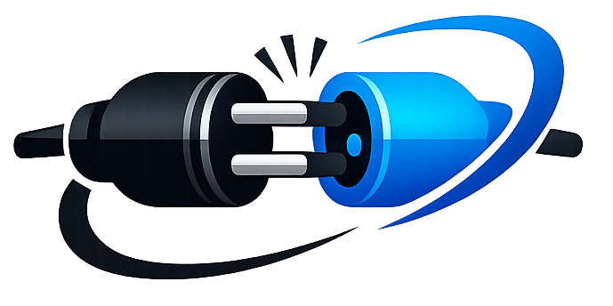

<div align="center">

  

  # ⚡ CONNECT

  **Your Centralized All-in-One Cloud Workspace for Notes, Canvas Whiteboards, Folders, Link Vaults & Assets**

  [](https://crosser.vercel.app)
  [](https://react.dev/)
  [](https://vitejs.dev/)
  [](https://supabase.com/)
  [](https://tailwindcss.com/)
  [](LICENSE)

  [🌐 Live Demo](https://crosser.vercel.app) • [Features](#-key-features) • [Screenshots](#-application-preview--screenshots) • [Developer & Socials](#-developer--social-links) • [Environment Setup](#-environment-variables--security) • [Getting Started](#-getting-started)

</div>

---

## 📖 Overview

**Connect** is a modern, high-performance web application designed to streamline personal productivity and asset management. Powered by **React 19**, **Vite**, and **Supabase**, Connect integrates a real-time Notepad, an interactive Whiteboard Canvas, a Folder Management System, a curated Link Vault, and Cloud Storage into a seamless, elegant interface with dark mode and glassmorphism styling.

> 🌐 **Live Web Application**: [https://crosser.vercel.app](https://crosser.vercel.app)

---

## 📸 Application Preview & Screenshots

<div align="center">

  ### Birth Of Connect 
  

  <br/><br/>

--------------------------------------------------------

  ### 🏠 Main Workspace & Top-Stacked Folders
  

<br/> <br/>

----------------------------------------------------------

  ### 🏠 Folders
  

  <br/><br/>

  -------------------------------------------------------------------------------

  ### 📝 Real-Time Notepad & Mobile Text Color Palette
  

-----------------------------------------------------

  <br/><br/>

  ### 🔗 Curated Link Vault
   


</div>

---

## ✨ Key Features

### 📁 1. Organized Top-Stacked Folder System & Sub-Folders
- **Folders Section (`📁 FOLDERS (N)`)**: Folders and sub-folders render in a dedicated top-stacked section above documents in a responsive 1 to 4 column sub-grid.
- **Folder Selection Checkbox (`☑`)**: Full support for batch selection (`Select All` / `Select`) on folder cards with glowing amber highlight ring (`ring-2 ring-amber-500/50`).
- **Custom Folder Empty State**: Custom folder empty view displaying `"[Folder Name]" is Empty` with glowing amber folder icon.
- **Zero-Conflict Destination Storage**: Files inside folders belong strictly to their parent folder (`folder_id`). Identical file names (e.g. `a.jpeg` at Root vs `a.jpeg` inside a Folder) exist independently without any conflict.
- **Breadcrumb Navigation**: Navigate seamlessly with breadcrumbs (`Documents / Folder Name`) and a 1-click `← Back to All Documents` control.

### 📌 2. Destination-Scoped Pinning
- **Top Priority Grid Sorting**: Pinned items (`is_pinned === true`) automatically float to the top of the grid with a glowing `📌 Pinned` badge.
- **Scoped Pin Limits**: Max **5 pinned items** at Root level, max **3 pinned items** inside any folder.
- **Local Storage Fallback Cache**: Pin states save instantly with local storage fallback (`connect_pinned_${user.id}`) to guarantee zero rollback errors.

### 🎯 3. Dynamic Filter Pills & Instant Search
- **Dynamic File Filters**: Toolbar filter pills (`All`, `Folders`, `PDFs`, `Images`, `Docs`) adapt dynamically based strictly on the file types present in your workspace view.
- **Instant Search with Clear Control**: Search input features an inline `✕` clear button and automatically resets when navigating folder levels.

### 📝 4. Dynamic Notepad
- **Real-Time Workspace**: Create, format, edit, and organize notes effortlessly.
- **Mobile-Responsive Text Color Palette**: Color swatches with fixed-size glowing ring borders (`ring-2 ring-sky-400`), visible on all screens (mobile, tablet, desktop).
- **Local Cache & Auto-Save**: Lightning-fast offline loading backed by debounced 1-second auto-saving and status indicators (`● Synced`).

### 🔗 5. Curated Link Vault
- **Bookmark Management**: Store, tag, and categorize URLs with custom titles and 1-click copy feedback.
- **Night & Light Mode Polish**: High-contrast Sky Blue (`text-sky-400`) in Night Mode and Blue (`text-blue-600`) in Light Mode.

### 🚀 6. Upload Progress Console
- **Slide Out Right Exit**: Auto-dismissing progress console with smooth 500ms `Slide Out Right` animation upon 100% completion.
- **Cancel Controls**: Batch cancellation and line-by-line file upload controls.

### 🌐 7. Developer Footer & Animated Tooltips
- **Direct Icon Redirect Buttons**: Quick-access social buttons with smooth animated hover tooltips (`Personal Portfolio`, `GitHub`, `LinkedIn`, `Instagram`, `Email Me`).
- **Developer Quote**: *"Great ideas connect when passion meets precision code."* — **Kartik Varma**

---

## 🌐 Developer & Social Links

Connect is designed and engineered by **Kartik Varma**. Feel free to connect or collaborate:

| Platform | Link / Username | Direct Link |
| :--- | :--- | :--- |
| **🚀 Live App** | `crosser.vercel.app` | [Open Connect Web App](https://crosser.vercel.app) |
| **🌐 Portfolio** | `kartikvarma.vercel.app` | [Visit Portfolio](https://kartikvarma.vercel.app) |
| **🐙 GitHub** | `varmakartik` | [View GitHub](https://github.com/varmakartik) |
| **💼 LinkedIn** | `kartivarma200430` | [Connect on LinkedIn](https://linkedin.com/in/kartivarma200430) |
| **📸 Instagram** | `@ig_crosser` | [Follow on Instagram](https://instagram.com/ig_crosser) |
| **✉️ Email** | `kartikvarma.dev@gmail.com` | [Send Email](mailto:kartikvarma.dev@gmail.com) |

---

## 🔒 Environment Variables & Security

> [!IMPORTANT]
> **Supabase credentials are managed via environment configuration files (`.env` and `.env.production`).**

### Environment Variable Files

| Variable Name | Description | Example / Required |
| :--- | :--- | :--- |
| `VITE_SUPABASE_URL` | Your Supabase Project API URL | `https://<your-project-id>.supabase.co` |
| `VITE_SUPABASE_ANON_KEY` | Your Supabase Public Anon Key | `sb_publishable_...` |

---

## 🗄️ Supabase Database & Storage Setup

### 1. Database Table (`items`)

Create or update the `items` table in Supabase Database:

```sql
create table public.items (
  id uuid default gen_random_uuid() primary key,
  user_id uuid references auth.users(id) on delete cascade not null,
  folder_id uuid references public.items(id) on delete cascade,
  title text not null,
  content text,
  url text,
  type text default 'note', -- 'note', 'folder', 'doc', 'pdf', 'image', 'link'
  is_pinned boolean default false,
  created_at timestamp with time zone default timezone('utc'::text, now()) not null,
  updated_at timestamp with time zone default timezone('utc'::text, now()) not null
);

-- Enable Row Level Security
alter table public.items enable row level security;

-- Index for folder performance
create index if not exists idx_items_folder_id on public.items(folder_id);

-- Policies for User Ownership
create policy "Users can view their own items" on public.items 
  for select using (auth.uid() = user_id);

create policy "Users can insert their own items" on public.items 
  for insert with check (auth.uid() = user_id);

create policy "Users can update their own items" on public.items 
  for update using (auth.uid() = user_id);

create policy "Users can delete their own items" on public.items 
  for delete using (auth.uid() = user_id);
```

### 2. Storage Bucket (`documents`)

1. Navigate to **Supabase Dashboard** > **Storage**.
2. Create a new bucket named **`documents`** with Public access.

---

## 🚀 Getting Started

```bash
# 1. Clone repository
git clone https://github.com/varmakartik/Connect.git
cd Connect

# 2. Install dependencies
npm install

# 3. Start local development server
npm run dev

# 4. Build for production
npm run build
```

---

## 📄 License

This project is licensed under the **MIT License**.

---

<div align="center">
  Crafted with ❤️ by <b>Kartik Varma</b>
</div>
